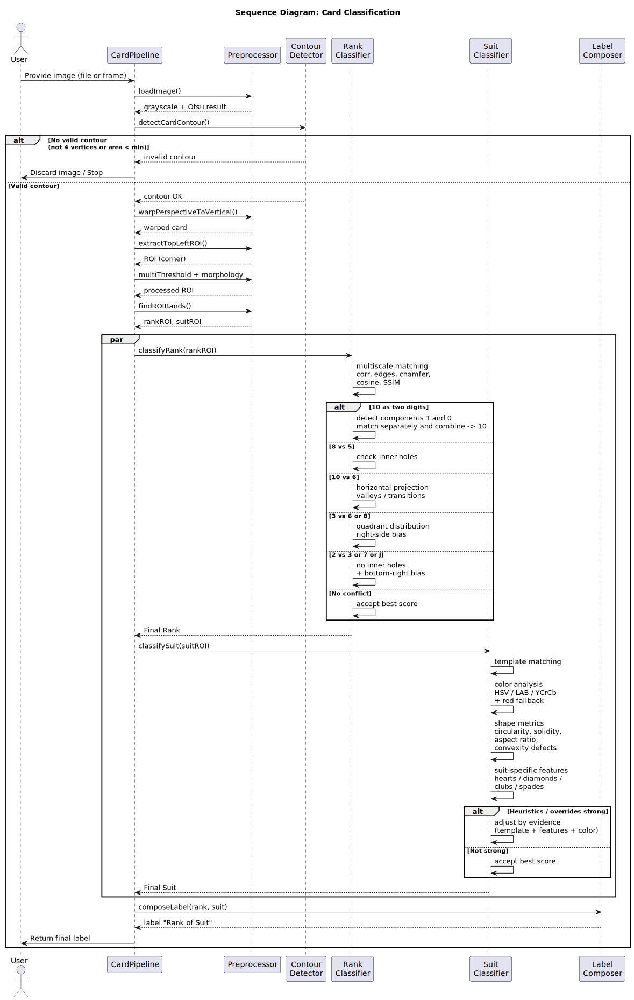

# Memoria técnica del sistema de reconocimiento de cartas

Autor: Diegoza04
Repositorio: [card_Detector](https://github.com/Diegoza04/card_Detector)

## Índice
1. Hardware: listado de elementos usados en el proyecto y justificación de uso
2. Software: características técnicas y requisitos. Justificación de uso.
3. Hoja de ruta del desarrollo
4. Solución:
   - Arquitectura y explicación
5. Otras tareas realizadas
6. Código fuente documentado 
7. Requisitos de ejecucion
8. Anexos / referencias

## 1. Hardware

### 1.1. Características técnicas y requisitos
- Cámara:
  - Fuente: Webcam local o cámara IP (DroidCam).
  - Resolución recomendada: 1280x720 (720p).
  - FPS recomendado: ≥ 30.
  - Conectividad: Red local para cámaras IP (WiFi/ethernet).
- Computadora:
  - CPU: x86_64 con soporte para operaciones vectoriales; recomendada ≥ 4 núcleos.
  - RAM: ≥ 8 GB (recomendado 16 GB para procesamiento en vivo estable).
  - GPU (opcional): No requerida; OpenCV opera en CPU.
  - Almacenamiento: ≥ 1 GB libre para plantillas, capturas y dependencias.

### 1.2. Justificación de uso
- Webcam/DroidCam: Facilita la captura en tiempo real sin hardware especializado. La resolución 720p equilibra calidad y latencia.
- CPU>RAM: El pipeline usa transformaciones de perspectiva, umbralización y análisis morfológico, que escalan mejor en CPU con suficiente RAM.
- GPU opcional: No necesaria al ser un método clásico basado en OpenCV con plantillas.

## 2. Software

### 2.1. Características técnicas y requisitos
- Sistema operativo: Windows 10/11, macOS, o Linux.
- Python: 3.9–3.12
- Librerías:
  - OpenCV (cv2) para procesamiento de imágenes.
  - NumPy para operaciones vectoriales.
  - SciPy (opcional) para suavizados gaussianos más precisos.
  - Matplotlib para visualizaciones.
- Fuentes de datos:
  - Directorio `template/` con plantillas por palo y valor.
  - Directorio `content/` para pruebas con imágenes de cartas.

### 2.2. Justificación de uso
- OpenCV/NumPy: Estándar, robusto y portable para visión clásica.
- SciPy: Mejora la detección de picos y suavizados, útil en condiciones de cámara en vivo.
- Matplotlib: Proporciona soporte de visualización y depuración.

## 3. Hoja de ruta del desarrollo

1. Exploración inicial:
   - Detección de carta por contorno (polígono de 4 vértices).
   - Warp de perspectiva para normalizar orientación.
2. Extracción de esquina superior-izquierda:
   - ROI con ratios adaptativos en función del tamaño de la carta.
3. Segmentación de símbolos (rank y palo):
   - Umbralización múltiple (Otsu + adaptativas).
   - Fusión controlada de cajas y separación por bandas verticales.
4. Construcción de plantillas:
   - Lectura de `template/`: generación de matrices por valor y palo.
   - Prototipos de color por palo (Corazones y Diamantes).
5. Clasificación:
   - Rank: matching multiescala, validaciones específicas (8 vs 5, 10 vs 6, 3 vs 6/8, 2 vs 3/7/J, “10” doble dígito).
   - Palo: combinación de template score + color + métricas de forma + features específicas (corazón/diamante/trébol/pica).
6. Detección en vivo:
   - Multi-carta con estabilización por celdas (historial y voto estable).
7. Refactorización:
   - Distribución por módulos sin modificar la lógica.
8. Documentación:
   - Memoria técnica, diagramas, y comentarios de código.

## 4. Solución

### 4.1. Diagrama de decisión (clasificación de cartas)

- Clasificación Rank:
  - Matching multiescala contra plantillas.
  - Reglas específicas:
    - “10” doble dígito: combinación de “1” y “0”.
    - 8 vs 5: componentes cerrados.
    - 10 vs 6: valles en proyección horizontal.
    - 3 vs 6/8: distribución por cuadrantes (sesgo a derecha).
    - 2 vs 3/7/J: componentes cerrados + sesgo inferior derecha.

- Clasificación Palo:
  - Template score (matching).
  - Color HSV/LAB/YCrCb con fallback.
  - Shape metrics: circularity, solidity, aspect ratio, defectos, vértices.
  - Features:
    - Corazón: picos superiores, simetría, redondez, ratio top/bottom.
    - Diamante: vértices ~4, aspect ratio ~1, uniformidad radial y angular, orientación 0°/45°.
    - Trébol: 3 lóbulos, base estrecha, complejidad superior, defectos convexidad.
    - Pica: punta superior, simetría lateral, base estrecha, aspect vertical.

### 4.2. Secuencialización de operaciones e interpretación de parámetros

1) Detección de contorno de carta
- `cv2.threshold(..., THRESH_BINARY + THRESH_OTSU)`: Otsu se adapta al brillo global del frame.
- `cv2.findContours(binary, RETR_EXTERNAL)`: se buscan contornos externos.
- `cv2.approxPolyDP(eps = 0.02 * perímetro)`: aproxima contorno a polígono; se eligen aquellos de 4 vértices y área mínima (≥ 10,000 px²).

Justificación:
- Otsu + vértices=4 ofrece robustez ante ruido de fondo y escenarios comunes en mesa.

2) Warp de perspectiva
- `order_points(...)`: ordena vértices en TL, TR, BR, BL.
- Ajuste horizontal → vertical si ratio width>height.
- Escalado para acercarse al aspect ratio 1.4 (altura/ancho).
- `cv2.getPerspectiveTransform(...)` + `cv2.warpPerspective` con destino vertical.

Justificación:
- Normalizar orientación y escala simplifica extracción de esquina y matching.

3) Extracción de esquina superior-izquierda (ROI)
- Ratios: `w_ratio≈0.32`, `h_ratio≈0.46`.
- Mínimos: `rw≥80`, `rh≥100`.
- Ajustes dinámicos si la carta warpada es pequeña.

Justificación:
- Evita recortes de símbolos y mejora estabilidad del matching, especialmente 10 y algunos palos con trazos largos.

4) Segmentación de símbolos en ROI
- Umbral combinado: Otsu + adaptativos (Gaussian y Mean).
- Morfología: `medianBlur(3)` + `MORPH_CLOSE` kernel `(2x2)`.
- Contornos: filtrado por área adaptativa `(h*w)//150`.
- Fusión horizontal controlada con `horizontal_gap=15`.
- Separación por bandas verticales: Rank arriba (~55%), Palo abajo (~≥35%).

Justificación:
- La combinación de umbrales captura mejor trazos bajo variaciones de iluminación.
- Fusión limitada evita mezclar “1” y “0” del “10”.
- Bandas verticales estabilizan la selección de rank/palo.

5) Matching de Rank
- `multi_template_scores`: escalas `[0.80...1.20]`, combinación de correlación, bordes, chamfer, coseno y SSIM.
- Validaciones específicas (8, 10, 3, 2).
- “10” doble dígito: intento de split en dos componentes y matching contra “1” y “0”.

Justificación:
- El score combinado cubre diferentes rasgos visuales.
- Las validaciones reducen confusiones comunes.

6) Clasificación de Palo
- Template score + color (HSV/LAB/YCrCb) con fallback rojo (dilatación).
- Métricas generales de forma (circularidad, solidez, aspecto).
- Features por palo (corazón/diamante/trébol/pica).
- Heurísticas por palo + overrides cuando hay evidencia fuerte.

Justificación:
- La combinación de template + color + forma reduce falsos positivos y desambiguaciones (rojo/negro y geometrías típicas).

7) Modo en vivo multi-carta
- Historial por celda (cuantización del centro del contorno).
- Voto estable con umbral de apariciones.
- Overlay con información y controles interactivos.

Justificación:
- Estabilización temporal mejora la precisión percibida y evita “parpadeos”.

## 5. Otras tareas realizadas

- Refactorización por módulos (io, geometry, roi, rank, features, resegment, suit, templates, pipeline) sin cambios de lógica.
- Exportación de resultados a CSV.
- Panel de depuración y overlay en vivo (FPS, cartas detectadas, lista lateral).
- Captura de cartas estables a disco.
- Manejo de errores y mensajes guía (cámara, red, URL).

## 6. Código fuente documentado

Se añadieron docstrings y comentarios en módulos para facilitar mantenimiento. Ver archivos en `card_detector/` y principales `card_dectector.py`, `live_detector.py`.

## 7. Requisitos de ejecución

- Instalación:
  - `pip install -r requirements.txt`
- Estructura de directorios:
  - `template/` con subdirectorios: `corazones/`, `diamantes/`, `picas/`, `treboles/`.
  - Nombres de archivos: `<rank>_<loquesea>.png` (ej: `10_diamantes.png`, `8_picas.jpg`).
- Comandos:
  - Modo lote: `python card_dectector.py --content-dir content --template-dir template`
  - Modo en vivo: `python card_dectector.py --live --camera-url http://IP:4747/video`

 ## 8. Anexos / referencias
 
- Repositorio: Diegoza04/card_Detector
- Herramientas sugeridas: OpenCV, NumPy, SciPy, pandoc (para PDF)
